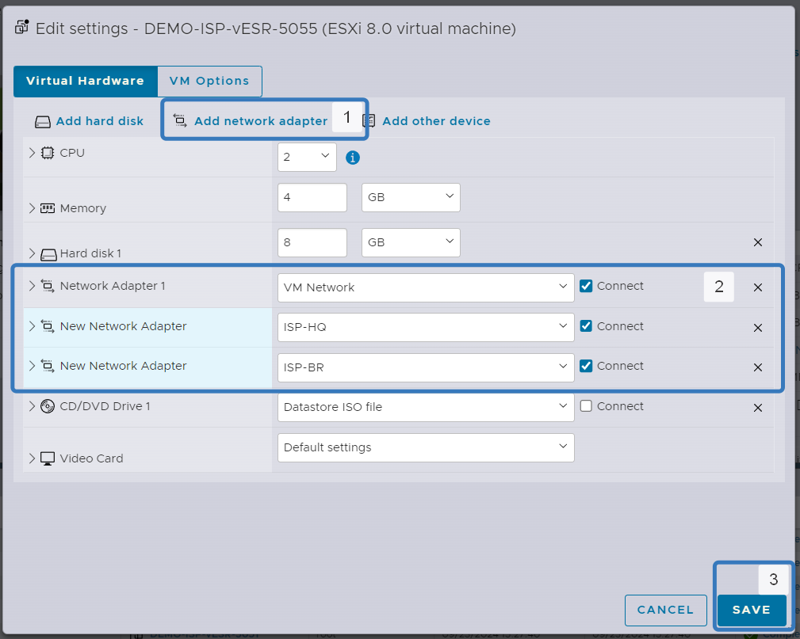

# Подключаем виртуальные машины

1. Заходим в виртуальную машину `BR-SRV`
2. Нажимаем `edit`

3. В пункте `Network adapter` выбираем виртуальную сеть `BR-Net`
4. Нажимаем кнопку `SAVE`

Повторяем эти действия для `HQ-SRV` и `HQ-CLI`

Для маршрутизаторов нужно будет добавить дополнительные интерфейсы. Во время добавления адаптерав виртуальная машина должна быть выключена.

1. Добавляем дополнительные сетевые адаптары нажав кнопку `Add network adapter`.
2. Изменяем сети которые подключены к этим адаптерам в соответствие с заданием.
3. Нажимаем кнопку `SAVE`

Повторяем эту процедуру для всех маршрутизаторов

