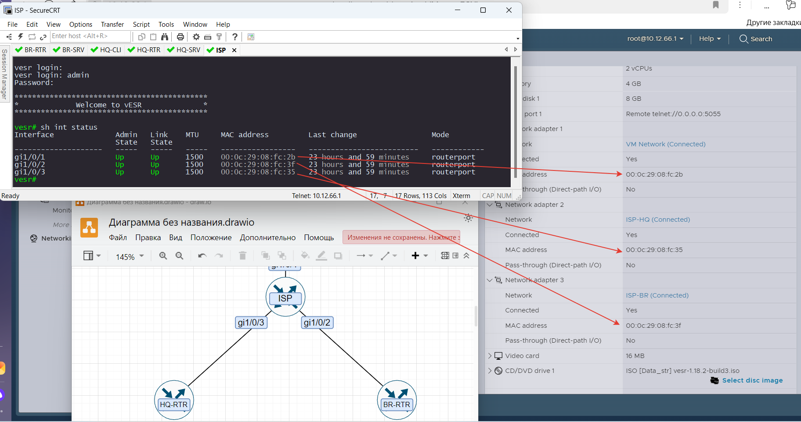
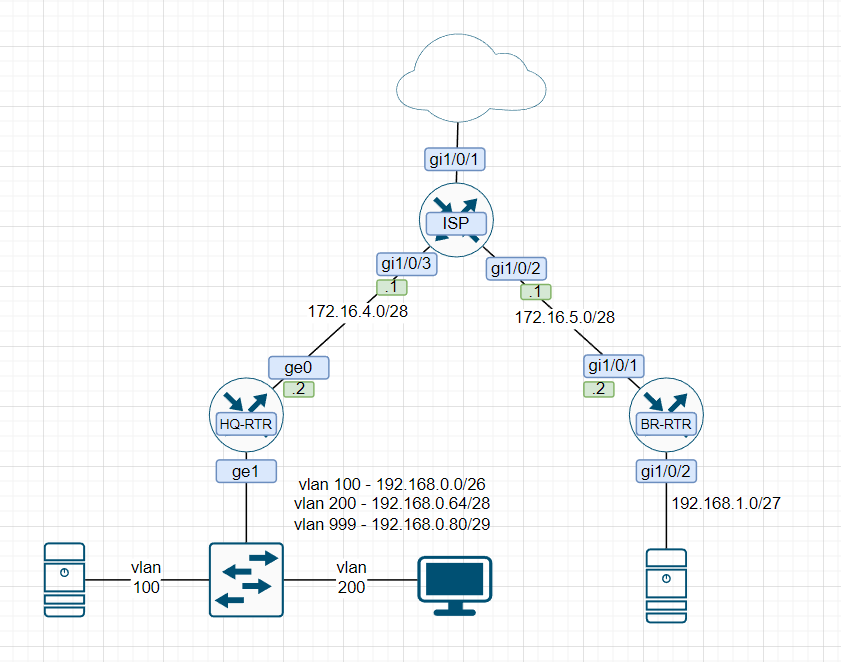

# Создание схемы сети

1. На основание мак адресов определяем какой интерфейс к какой сети подключен. Теперь можем составить схему сети.
У каждого она будет своя.

Вывод информации об интерфейсах

vESR - `show interfaces status`

EcoRouter - `show port`

ALT - `ip a`

