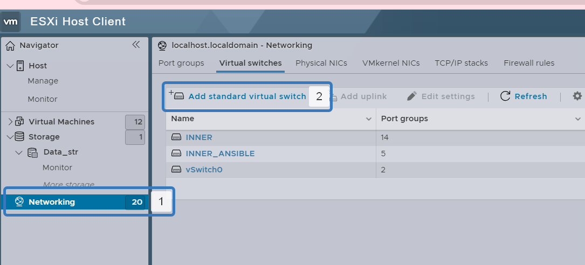
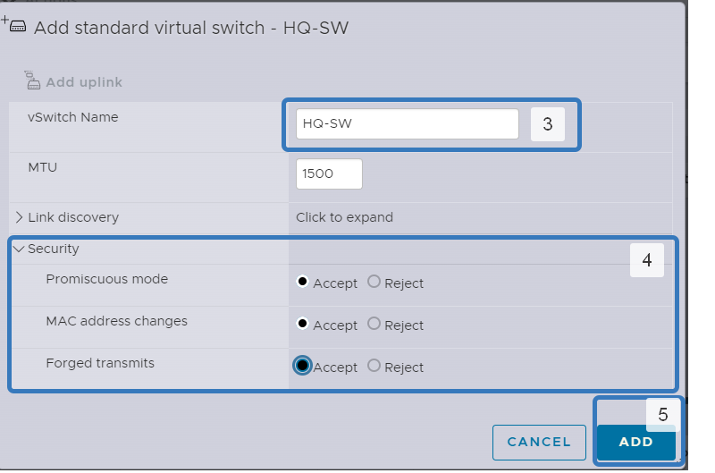
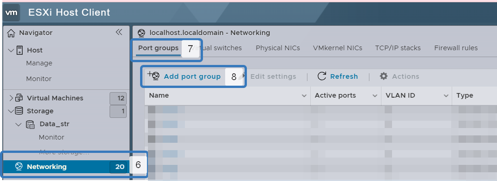
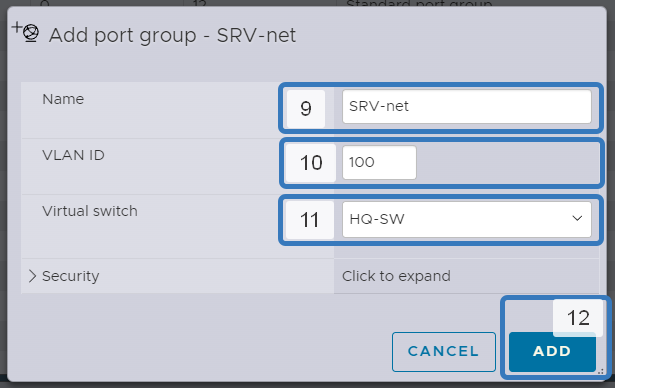

# Создание виртуальных подключений

1. Переходим в раздел `Networking` затем во вкладку `Virtual switchs`
2. Добавляем новый виртуальный коммутатор `add standart virtual switch`

3. Задаем имя новому виртуальному коммутатору `HQ-SW`
4. Раскрываем пункт `Security` изменяем все пункты на `Accept`
5. Нажимаем кнопку `ADD`

6. Переходим в раздел `Networking`
7. Переходим во вкладку `Port groups`
8. Добавляем новую порт группу `add port group`

9. Задаем имя порт группе в соответствие с топологией. В этом примере создаем сеть для `HQ-SRV`
10. Задаем номер `VLAN` в соответствие с заданием. В этом примере это номер 100
11. Подключаем эту порт группу в коммутатору, который создали на предыдущем этапе
12. Нажиамем кнопку `ADD` 

13. Проделываем этапы с 6 по 12 для `CLI-net`. Для `HQ-net` нужно сделать `trunk` режим. Для этого в поле `VLAN ID` задаем значение `4095`

В результате должно получиться `три` виртуальныйх коммутатора и `пять` порт групп

