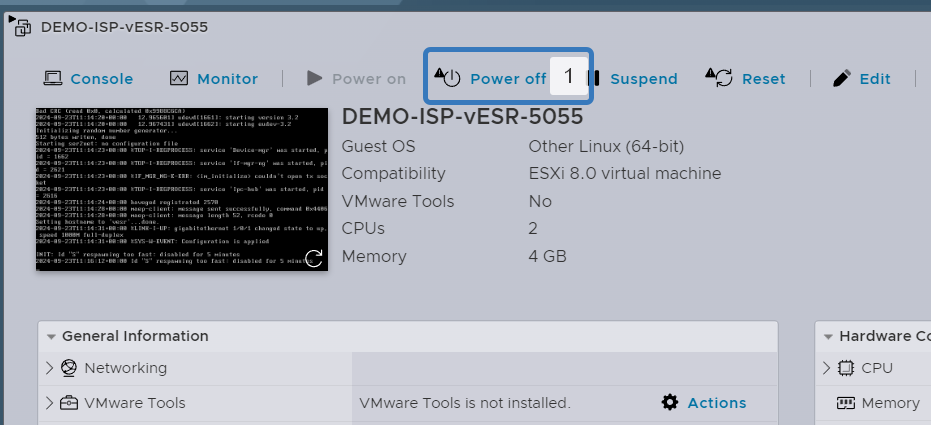
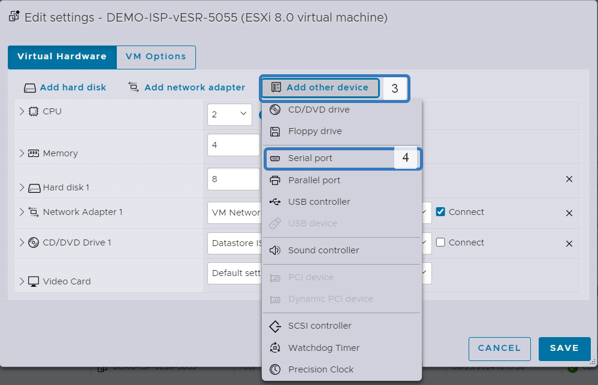

# Настройка внеполосного управления

1. Выключаем виртуальную машину нажав кнопку `Power off`
2. Переходим в редактирование виртуальноый машины нажав кнопку `Edit`



3. Добавляем новое устройство нажав на `Add other device`
4. Выбираем пункт `Serial port`



5. Изменяем тип порта на `Use network`
6. В строку `Port URL` добавляем значение в формате `telnet://0.0.0.0:<port>`. Номер порта для каждой виртуальной машины должен быть уникальным
7. Сохраняем изменения нажав кнопку `SAVE`
8. Включаем виртуальную машину.


Проделываем эту процедуру для всех виртуальных машин.

В виртуальных машинах с `Linux` нужно включить службу, добавить ее в автозагрузку и проверить статус:

```
systemctl start serial-getty@ttyS0.service
systemctl enable serial-getty@ttyS0.service
systemctl status serial-getty@ttyS0.service
```

Открывам любую консольку и подключаемся к `ESXi` с ее помощью по протоколу `telnet`

В этом примере используется `PUTTY`

1. Вписываем ip адрес вашего стенда.
2. Указываем порт, который указывали в настройуках виртуальной машины.

