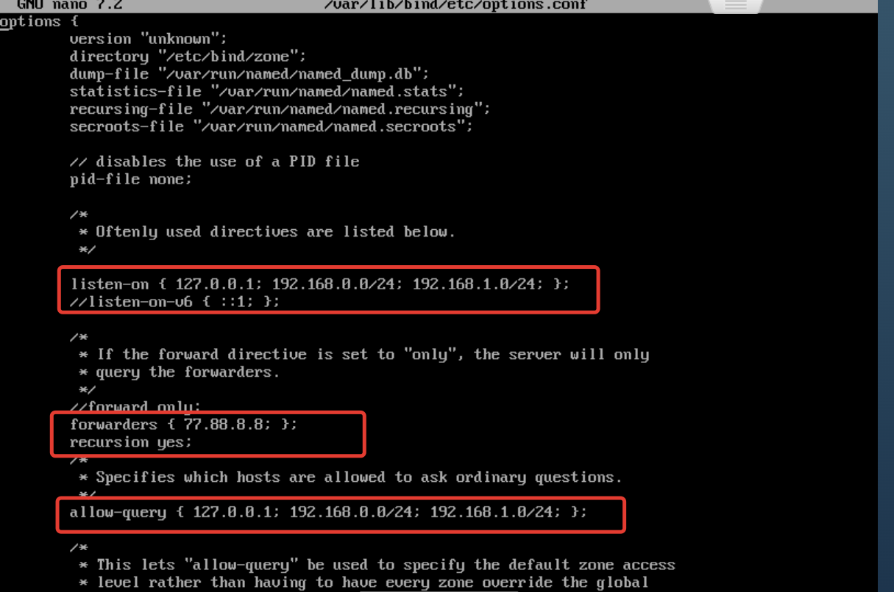
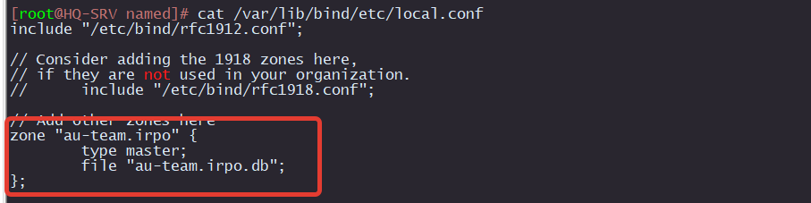
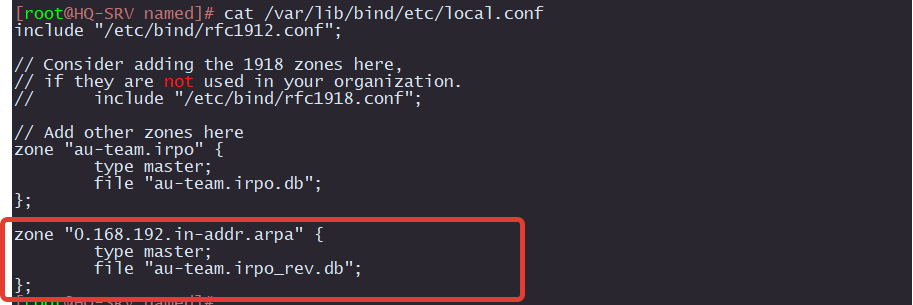
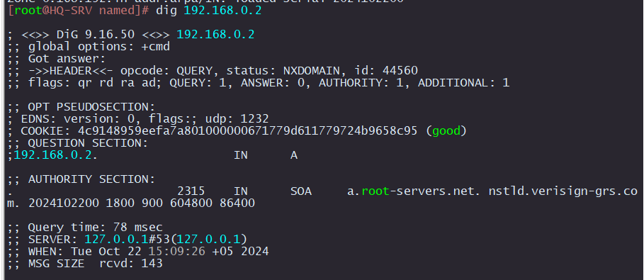
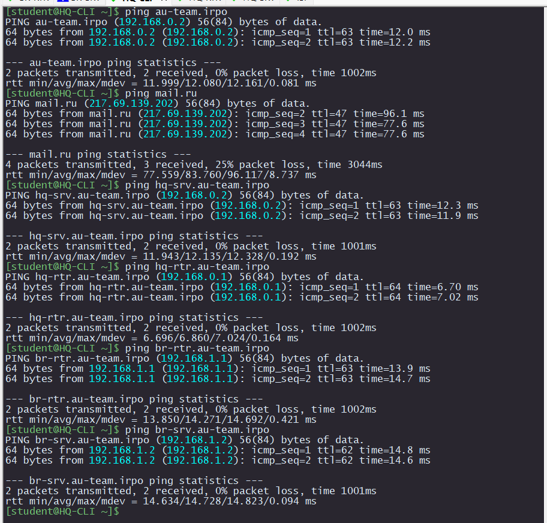

# Настройка DNS с помощью bind

## HQ-SRV

Устанавливаем bind:

```
apt-get install bind bind-utils
```

Редактируем конфиг:

```
nano  /var/lib/bind/etc/options.conf
```

Изменяем следующие параметры




Проверяем на ошибки

```
named-checkconf
```

Если появилась вот такая ошибка:


 
Нужно скофигураровать ключи с помощью `rndc-confgen`


Редактируем файл `var/lib/bind/etc/rndc.key `
```
nano /var/lib/bind/etc/rndc.key 
```

Встравляем в него ключ, который получили при помощи `rndc-confgen`


Проверяем на ошибки

```
named-checkconf
```

Если ошибок нет, то запускаем `bind`

```
systemctl enable --now bind
```
Проверяем что `bind` работает

```
systemctl status bind
```


Редактируем `resolv.conf`

```
nano /etc/net/ifaces/ens192/resolv.conf 
```

```
search au-team.irpo
nameserver 127.0.0.1
nameserver 192.168.0.2
nameserver 77.88.8.8
```

Перезагружаем сеть

```
systemctl restart network
```

Проверяем

```
dig ya.ru
```


### Создаем зону прямого 

```
nano  /var/lib/bind/etc/local.conf
```

```
zone "au-team.irpo" {
        type master;
        file "au-team.irpo.db";
};
```



Создаем копию файла-шаблона прямой зоны `/var/lib/bind/etc/zone/localdomain`

```
# cp /var/lib/bind/etc/zone/localdomain  /var/lib/bind/etc/zone/au-team.irpo.db
```

Задаем права на файл
```
chown named. /var/lib/bind/etc/zone/au-team.irpo.db

chmod 600 /var/lib/bind/etc/zone/au-team.irpo.db
```

Открываем для редактирования

```
nano /var/lib/bind/etc/zone/au-team.irpo.db
```

```
$TTL    1D
@       IN      SOA     au-team.irpo. root.au-team.irpo. (
                                2024102200      ; serial
                                12H             ; refresh
                                1H              ; retry
                                1W              ; expire
                                1H              ; ncache
                        )
        IN      NS      au-team.irpo.
        IN      A       192.168.0.2
hq-rtr  IN      A       192.168.0.1
br-rtr  IN      A       192.168.1.1
hq-srv  IN      A       192.168.0.2
hq-cli  IN      A       192.168.0.66
br-srv  IN      A       192.168.1.2
moodle  IN      CNAME   hq-rtr
wiki    IN      CNAME   hq-rtr
```

Проверяем, что зона настроена Предварительно

```
named-checkconf -z
```


Перезагружаем `bind`

```
systemctl restart bind
```

Проверяем

```
dig hq-srv.au-team.irpo
```


### Создаем зону обратного просмотра и PTR записи

```
nano  /var/lib/bind/etc/local.conf
```

```
zone "0.168.192.in-addr.arpa" {
        type master;
        file "au-team.irpo_rev.db";
};
```



Копируем шаблон файла

```
cp /var/lib/bind/etc/zone/{127.in-addr.arpa,au-team.irpo_rev.db}
```

Задаем права на файл
```
chown named. /var/lib/bind/etc/zone/au-team.irpo_rev.db

chmod 600 /var/lib/bind/etc/zone/au-team.irpo_rev.db
```

Открываем для редактирования

```
nano /var/lib/bind/etc/zone/au-team.irpo_rev.db
```

```
$TTL    1D
@       IN      SOA     au-team.irpo. root.au-team.irpo. (
                                2024102200      ; serial
                                12H             ; refresh
                                1H              ; retry
                                1W              ; expire
                                1H              ; ncache
                        )
        IN      NS      au-team.irpo.
1       IN      PTR     hq-rtr.au-team.irpo.
2       IN      PTR     hq-srv.au-team.irpo.
66      IN      PTR     hq-cli.au-team.irpo.
```

Проверяем

```
named-checkconf -z
```


Перезагружаем `bind`

```
systemctl restart bind
```

Проверяем

```
dig 192.168.0.2
```



### Комплекская проверка с HQ-CLI

