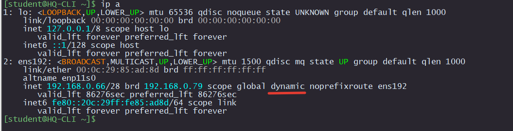

# Настройка DHCP на HQ-RTR (EcoRouter)

```
ip pool HQ-NET200 1
 range 192.168.0.66-192.168.0.70
!
dhcp-server 1
 lease 86400
 mask 255.255.255.0
 pool HQ-NET200 1
  dns 192.168.0.2
  domain-name au-team.irpo
  gateway 192.168.0.65
  mask 255.255.255.240
!
interface HQ-CLI
 dhcp-server 1
!
```
## Проверка



