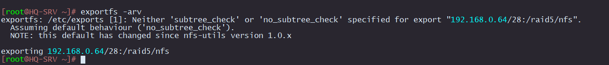
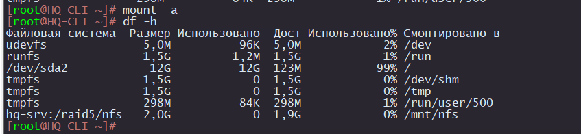

# Настройка NFS сервера

## Настройка сервера HQ-SRV

1. Устанавливаем пакеты

```
apt-get update &&  apt-get install -y nfs-{server,utils}
```

2. Создаем директорию, котороя будет доступна по сети

```
mkdir /raid5/nfs
```

3. Выдаем права на чтение и запись в этой директории:

```
chmod 766 /raid5/nfs
```

4. Добавляем кому можно подкючаться к ней по сети

```
echo "/raid5/nfs 192.168.0.64/28(rw,no_root_squash)" > /etc/exports
```

`/raid5/nfs` - общий ресурс

`192.168.0.64/28 `- клиентская сеть, которой разрешено монтирование общего ресурса

`rw` — разрешены чтение и запись

`no_root_squash` — отключение ограничения прав root

5. Производим экспорт

```
exportfs -arv
```

`-a` - экспортировать все указанные каталоги

`-r` - повторный экспорт всех каталогов, синхронизируя /var/lib/nfs/etab с /etc/exports и файлами в /etc/exports.d

`-v` - подробный вывод



6. Включаем `nfs-server`

```
systemctl enable --now nfs-server
```

7. Проверяем, что nfs-server работатет

```
systemctl status nfs-server.service 
```


## Настройка NFS клиента на HQ-CLI

1. Устанавливаем пакеты

```
apt-get update && apt-get install -y nfs-{utils,clients}
```

2. Создаем директорию для монтирования сетевого ресурса

```
mkdir /mnt/nfs
```

3. Задаем права созданной директории

```
chmod 777 /mnt/nfs
```

4. Добавляем строку в `/etc/fstab` для автоматического монтирования общего ресурса:

```
echo "hq-srv:/raid5/nfs  /mnt/nfs  nfs  defaults  0  0" > /etc/fstab
```

5. Проверяем, что ресурс примонтирован

```
df -h
```



На `HQ-CLI` создадим файл с содержимым `test`

```
echo test > /mnt/nfs/test-cli
```

На `HQ-SRV` проверяем, что файл появился

```
cat /raid5/nfs/test-cli
```