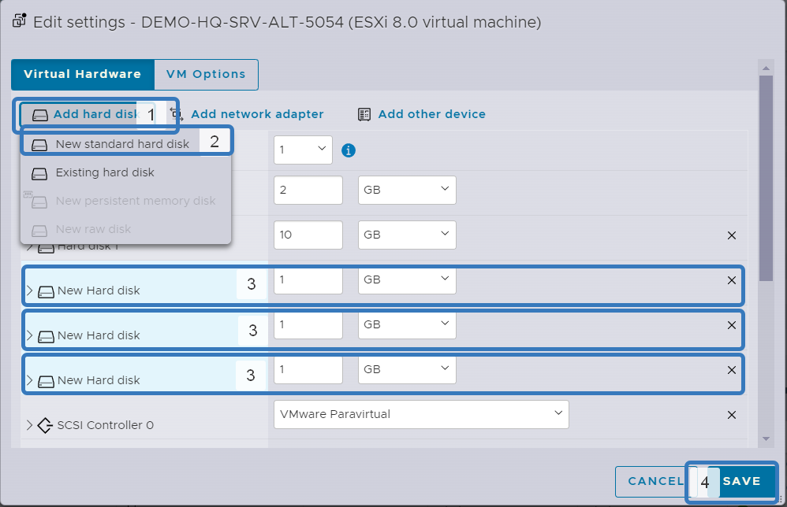
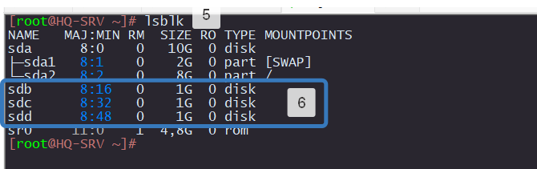
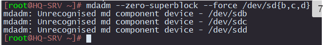
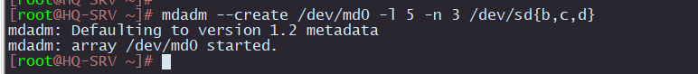
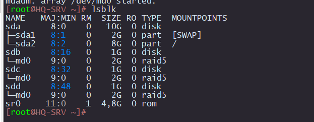
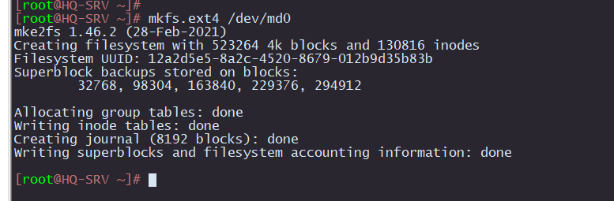
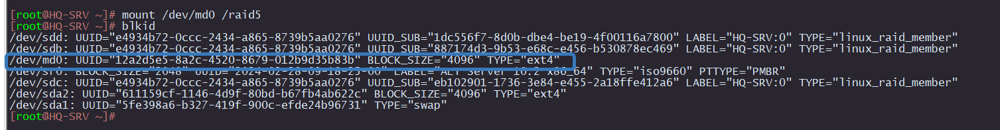
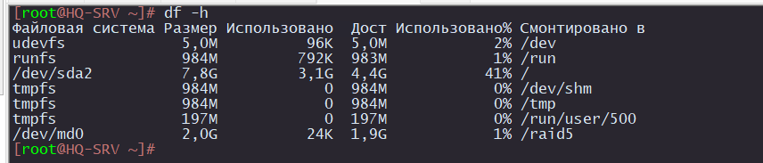

# Настройка RAID-5 на HQ-SRV
 
## HQ-SRV

1. Выключаем виртуальную машину.
2. Добавляем три новых HDD.
3. Изменяем объём добавленных HDD на 1 Gb.
4. Сохраняем настройки и включаем виртуальную машину



Проверяем что диски добавились.

5. Вводим комманду `lsblk`
6. Запоминаем названия дисков (sdb, sdc, sdd)



7. Обнуляем диски 

```
mdadm --zero-superblock --force /dev/sd{b,c,d}
```


8. Создаем RAID-5 из трех дисков

```
mdadm --create /dev/md0 -l 5 -n 3 /dev/sd{b,c,d}
```

`/dev/md0` - название RAID после сборки

`-l 5` - уровень RAID

`-n 3` - количество дисков, из которых собирается массив

`S` - диски, которые объединяются



9.  Проверяем, что диск создан

```
lsblk
```



10. Создаем конфигурацию для mdadm

```
echo "DEVICE partitions" > /etc/mdadm.conf
mdadm --detail --scan | awk '/ARRAY/ {print}' >> /etc/mdadm.conf
```

11. Создаем файловую систему

```
mkfs.ext4 /dev/md0
```


12. Создаем папку в которую будем монтировать диск

```
mkdir /raid5
```

13. Мотируем диск

```
mount /dev/md0 /raid5
```

14. Проверяем и запоминаем UUID

```
blkid
```




15. Добавляем в автозагрузку монтирование диска

```
echo "UUID=12a2d5e5-8a2c-4520-8679-012b9d35b83b       /raid5  ext4    defaults        0       0" > /etc/fstab
```

16. Размонтируем существующий диск

```
umount /raid5
```

17. Монтируем в автоматическом режиме

```
mount -a
```

18. Проверяем, что диск есть

```
df -h
```

