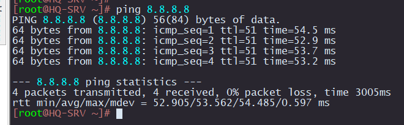

# Настройка NAT

## ISP

```
object-group network LOCAL_NET
  ip address-range 172.16.5.1-172.16.5.2
  ip address-range 172.16.4.1-172.16.4.2
exit

nat source
  ruleset SNAT
    to interface gigabitethernet 1/0/1
    rule 1
      match source-address LOCAL_NET
      action source-nat interface
      enable
    exit
  exit
exit
```

## HQ-RTR

```
interface TO-ISP
 ip nat outside
!
interface HQ-SRV
 ip nat inside
!
interface HQ-CLI
 ip nat inside
!
interface HQ-MGMT
 ip nat inside
!
ip nat pool NAT_POOL 192.168.0.1-192.168.0.254
!
ip nat source dynamic inside-to-outside pool NAT_POOL overload interface TO-ISP
```

## BR-RTR

```
object-group network LOCAL_NET
  ip address-range 192.168.1.1-192.168.1.30
exit

nat source
  ruleset SNAT
    to interface gigabitethernet 1/0/1
    rule 1
      match source-address LOCAL_NET
      action source-nat interface
      enable
    exit
  exit
exit
```

## Проверка




